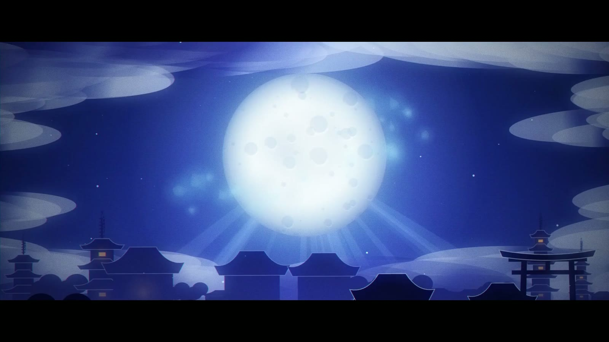
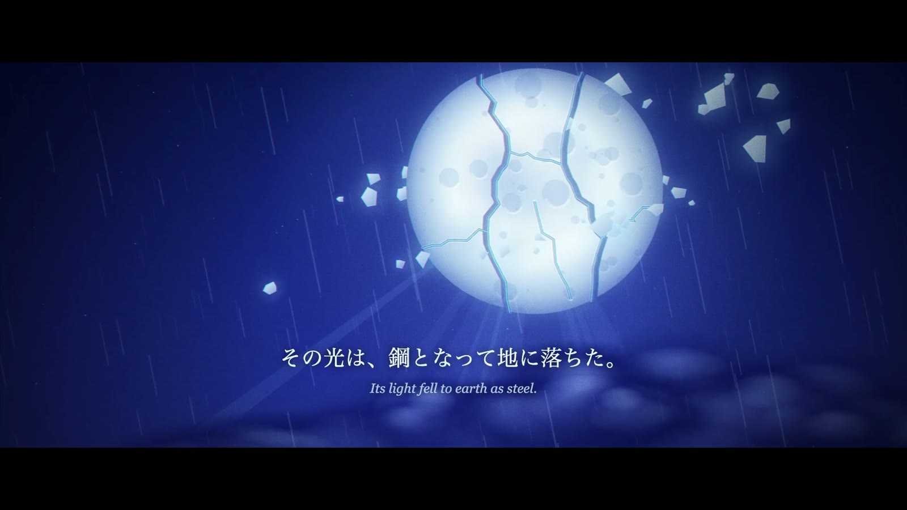
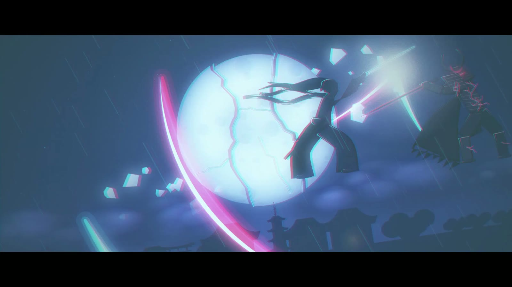
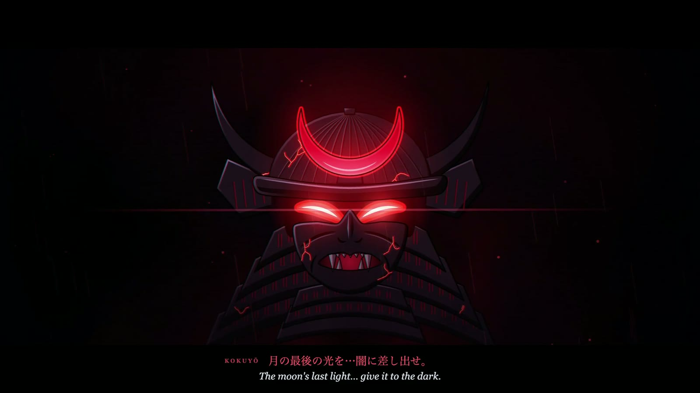
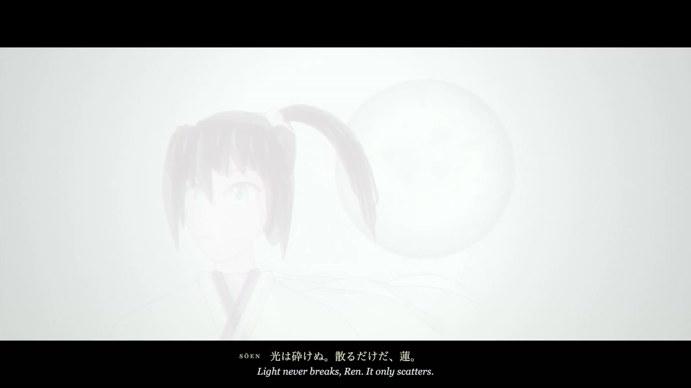

# html-anime

**Prompt an anime. Your coding agent draws it in code.**

<p>
  <a href="https://blixvip.github.io/html-anime/"></a>
  <a href="LICENSE"></a>
  
  
</p>

An anime, written as HTML. You write a scene. [The site](https://blixvip.github.io/html-anime/) turns it into a shot sheet: holds, one expensive shot, a closed color script. Paste that sheet into Claude, Codex, Cursor, or Grok. The agent draws the frames.

The pictures are HTML, timed for [HyperFrames](https://github.com/heygen-com/hyperframes). Nothing here calls a video model.

## The film

Kokuyō. Watch it on [the site](https://blixvip.github.io/html-anime/) or open [media/film.mp4](media/film.mp4).











## Start

```
git clone https://github.com/blixvip/html-anime.git
cd html-anime
```

Open the folder in the agent you already use and paste a sheet as the first message. The site builds the sheet in the browser. `harness/compile.js` builds the same sheet in Node.

Serve the site from this folder, then open the address it prints:

```
python -m http.server
```

Opening `index.html` as a file shows that same instruction. The sheet will not run until the folder is served.

Or build a sheet in Node (no dependencies):

```js
import { compileBrief } from "./harness/compile.js";

const sheet = compileBrief({
  logline: "On a roof in the rain, a red moon opens and a line of light falls.",
  seconds: 8,          // 8, 12, or 20
  aspect: "16:9",      // or "9:16"
  script: "indigo",    // indigo, eclipse, noon, or festival
  dialogue: "The rain hid the sound of the blade.",
});
console.log(sheet.ok ? sheet.markdown : sheet.error);
```

| Agent | What it reads | Open |
| --- | --- | --- |
| Claude Code | `CLAUDE.md` | `claude` |
| Codex | `AGENTS.md` | `codex` |
| Cursor | `.cursor/rules/html-anime.mdc` | `cursor .` |
| Grok | `AGENTS.md` | `grok` |

## What is in the repo

- `index.html` — the site
- `skills/html-anime-direct/SKILL.md` — which shots exist
- `skills/html-anime-cel/SKILL.md` — how a frame is painted
- `skills/html-anime-timing/SKILL.md` — twos, holds, the smear
- `skills/html-anime-camera/SKILL.md` — the cut and the frame
- `skills/html-anime-render/SKILL.md` — the HyperFrames file
- `harness/compile.js` — logline to sheet
- `media/film.mp4` — Kokuyō, the film
- `media/city.jpg`, `media/moon.jpg`, `media/fight.jpg`, `media/helm.jpg`, `media/ren.jpg` — stills from it
- `films/roof/` — an 8 second reference. File shape and the color-dip cut, not a film to remix
- `AGENTS.md` — the contract

## Test

```
npm test
```

Checks that every runtime sums exactly and has one sakuga shot, and that the sheet carries the size, frame count, and dialogue.

## Render the reference

```
cd films/roof
npx hyperframes preview
```

Lint before you trust a new film:

```
npx hyperframes lint
npx hyperframes validate
```

## Sheet rules the agent is not allowed to break

- Shot times sum to 8, 12, or 20 seconds
- One sakuga shot. The others stay on three drawings
- Acting on twos. Rain and a blade on ones
- Only the hexes printed on the sheet
- The line you wrote, verbatim, or no dialogue at all

## License

[MIT](LICENSE). The reference film's font keeps its own license: see [films/roof/fonts/NOTICE.txt](films/roof/fonts/NOTICE.txt).
